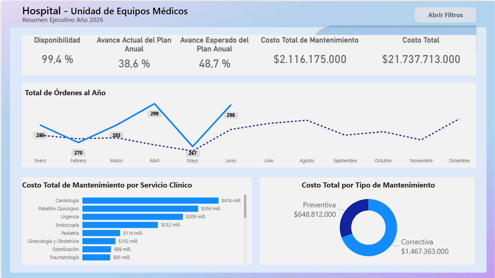
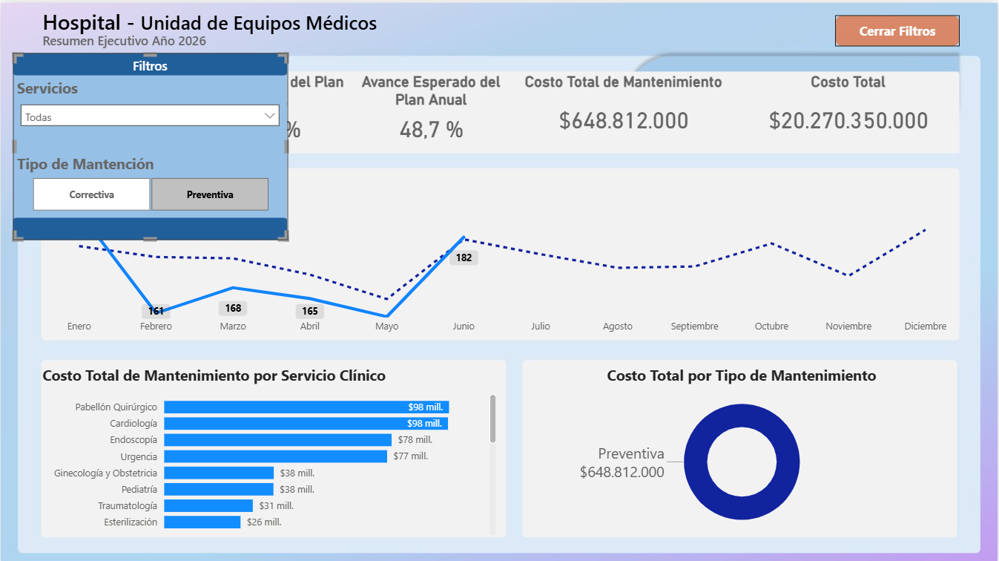
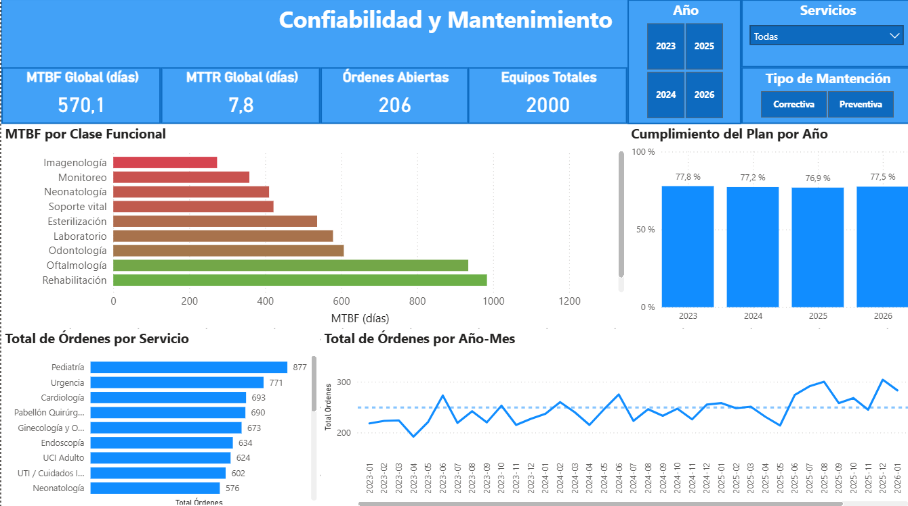
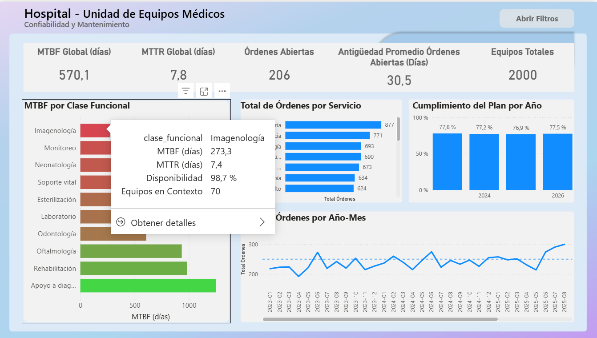
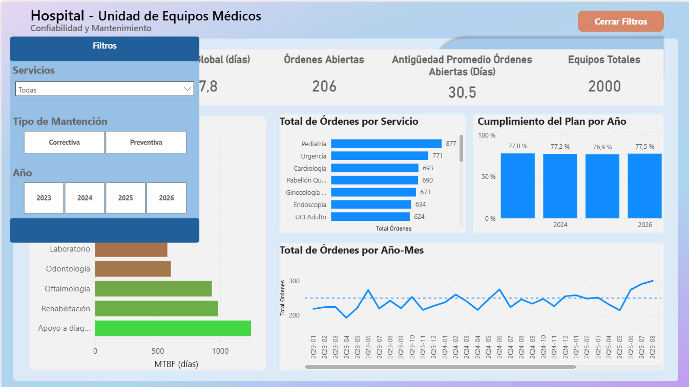
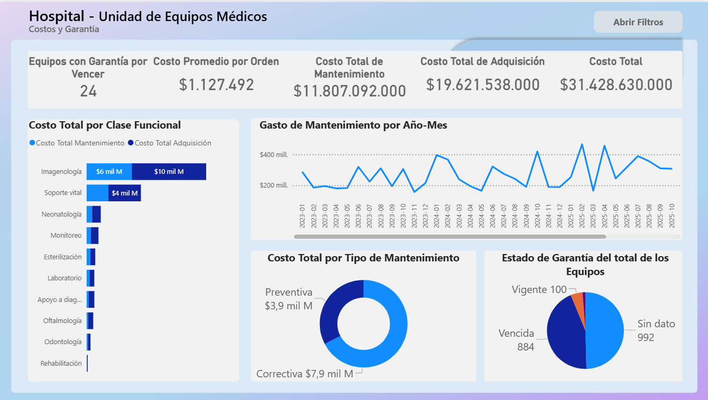
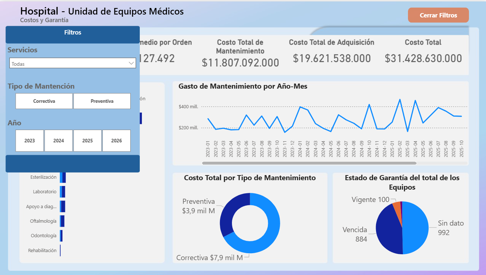
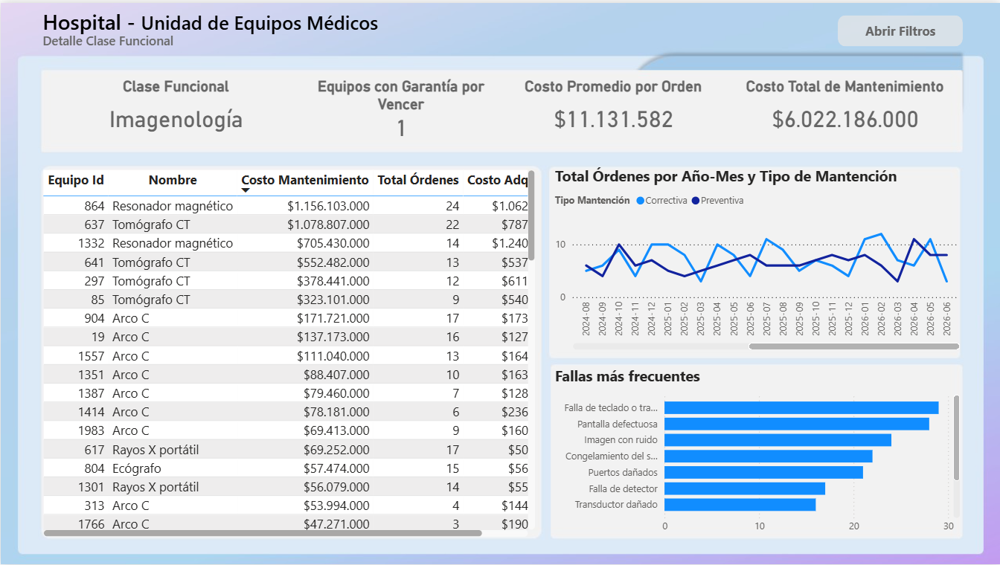
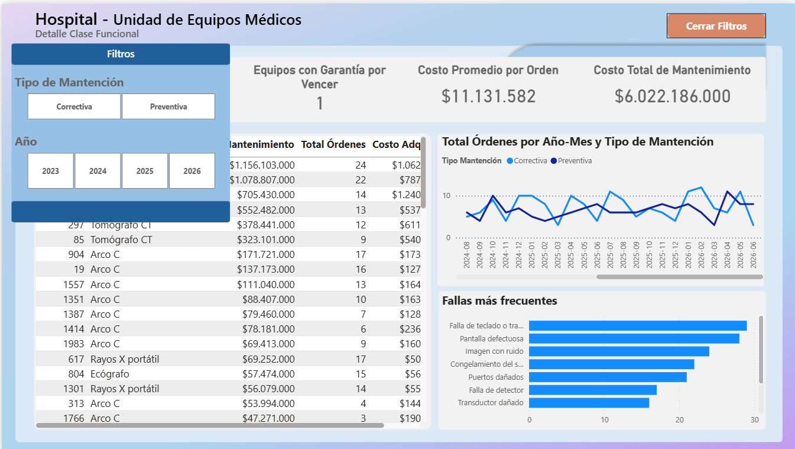
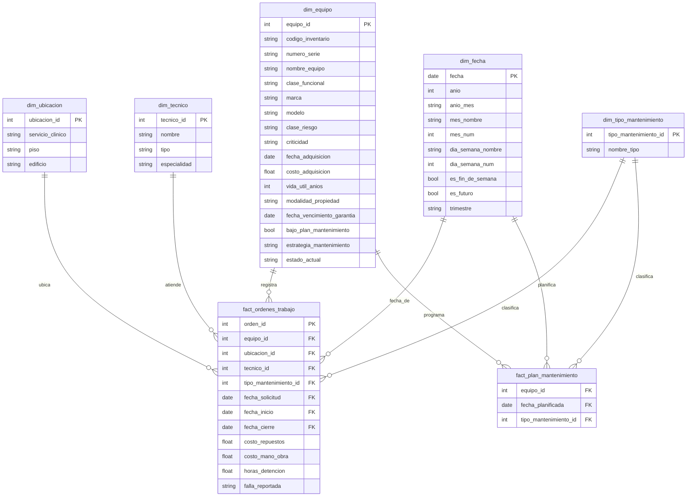

# Dashboard de Gestión de Mantenimiento de Equipos Médicos Hospitalarios

Dashboard simulado para la gestión de mantenimiento con 2000 equipos médicos en un hospital sobre un pipeline de datos reproducible y testeado.

- Modelé el dominio de mantenimiento hospitalario incluyendo los tipos de mantención, criticidad, clases funcionales, tipos de intervención.
- El cumplimiento del plan responde la proporción de los planes preventivos cumplidos de los evaluables, entendiendo que los evaluables son los que están antes del corte, el avance del plan es de los planes ejecutados y los planes totales que deben hacerse en el año.
- Apliqué un SEED fijo, 27 tests, CI verde y el modelo está versionado como PBIP.
- La clase funcional de Imagenología concentra el 51% del costo con 3,5% del total de equipos.

## Escenario
Hospital chileno de complejidad media-alta con 2000 equipos, en una ventana desde el 1 de enero de 2023 hasta el 30 de junio de 2026, generándose un corte, por lo que equipos con ordenes después del corte no son evaluables. Conjunto de datos sintéticos y reproducibles con SEED. Los hospitales y clínicas gestionan cientos de equipos médicos, cuya información suele registrarse en varias planillas. Parte de la complejidad de esto es la dificultad de desglosar costos anuales o mensuales, mantenciones o decisiones sobre ciertos equipos, etc.

### Página 1 - Resumen Ejecutivo

Monitoreo del año en curso.

**Tarjetas:**
- **Disponibilidad:** porcentaje de horas en que los equipos estuvieron disponibles en el periodo.
- **Avance Actual del Plan Anual:** proporción de órdenes ejecutadas sobre las órdenes totales planificadas del periodo.
- **Avance Esperado del Plan Anual:** proporción del plan que ya debió ejecutarse a la fecha de corte (referencia para interpretar el avance actual).
- **Costo Total de Mantenimiento:** suma de los costos de mantenimiento realizados.
- **Costo Total:** suma de los costos de mantenimiento y de adquisición.

**Visualizaciones:**
- **Total de Órdenes al Año:** compara el total de órdenes mes a mes de 2026 (línea sólida, cortada en junio) contra 2025 (línea punteada de referencia).
- **Costo Total de Mantenimiento por Servicio Clínico**
- **Costo Total por Tipo de Mantenimiento:** proporción entre costo correctivo y preventivo.

### Página 2 - Confiabilidad y Mantenimiento

Análisis operacional.

**Tarjetas:**
- **MTBF Global (días):** *Mean Time Between Failures*. Tiempo operativo globla entre fallas de los equipos.
- **MTTR Global (días):** *Mean Time To Repair*. Tiempo promedio para reparar un equipo (de inicio a cierre de la orden).
- **Órdenes Abiertas:** órdenes de mantención aún no cerradas.
- **Antigüedad Promedio Órdenes Abiertas (días):** días promedio que las órdenes abiertas llevan sin cerrar.
- **Equipos Totales:** total de equipos del establecimiento.

**Visualizaciones:**
- **MTBF por Clase Funcional:** barras con color de severidad (rojo = peor confiabilidad), más un tooltip que detalla MTTR, disponibilidad y número de equipos por clase.
- **Cumplimiento del Plan por Año:** porcentaje de planes preventivos cumplidos sobre los evaluables.
- **Total de Órdenes por Servicio**
- **Total de Órdenes por Año-Mes:** evolución mensual; la carga correctiva sube en invierno.

### Página 3 - Costos y Garantía

Análisis económico. 

**Tarjetas:**
- **Equipos con Garantía por Vencer:** equipos cuya garantía vence dentro de los próximos 6 meses.
- **Costo Promedio por Orden**
- **Costo Total de Mantenimiento**
- **Costo Total de Adquisición**
- **Costo Total:** mantenimiento más adquisición.

**Visualizaciones:**
- **Costo Total por Clase Funcional:** compara costo de mantenimiento contra costo de adquisición por clase.
- **Gasto de Mantenimiento por Año-Mes**
- **Costo Total por Tipo de Mantenimiento**
- **Estado de Garantía del Total de Equipos:** cuatro categorías; vigente, por vencer, vencida y sin dato.

### Página 4 - Detalle Clase Funcional

Drill-through desde cualquier clase en la página 2; informa costos, órdenes, fallas.

**Tarjetas:**
- **Clase Funcional:** la clase seleccionada en el drill-through.
- **Equipos con Garantía por Vencer**
- **Costo Promedio por Orden**
- **Costo Total de Mantenimiento**

**Visualizaciones:**
- **Tabla de equipos individuales:** cada equipo con su costo, número de órdenes y costo de adquisición.
- **Total de Órdenes por Año-Mes y Tipo de Mantención**
- **Fallas más Frecuentes:** ordenadas por número de órdenes.

## Hallazgos
- **Concentración de costos:**  El 51% del costo se concentra en imagenología, donde la cantidad correspondiente del total de equipos es de solo el 3,5%. A través del drill-through los tomógrafos y resonadores corresponden al 71% del costo de la clase. Puede ser viable reemplazar el equipo.
- **Garantía:** El 94% de los equipos presenta garantía vencida o no registrada. Es crucial realizar un catastro de equipos no registrados para conocer su estado de garantía, y los equipos vencidos considerar su vida útil y MTBF con MTTR para evaluar un reemplazo.
- **Estacionalidad:** Durante la estación de invierno hay una concentración de mantenimientos correctivos, se sugiere aumentar el mantenimiento preventivo de los equipos.

## Arquitectura de datos

fact_ordenes transaccional, fact_plan factless, dim_fecha en DAX

## Limitaciones y roadmap
- Los equipos dados de baja no tienen una fecha asignada.
- No se modela un calendario con la inclusión de feriados.
- No se incluyen funciones de RLS por servicio, pruebas de tolerancia  ni páginas QA

## Cómo reproducir
WSL + uv · SEED=46 · pytest · abrir powerbi/*.pbip

## Stack
Python · Power BI · pytest · ruff · GitHub Actions

