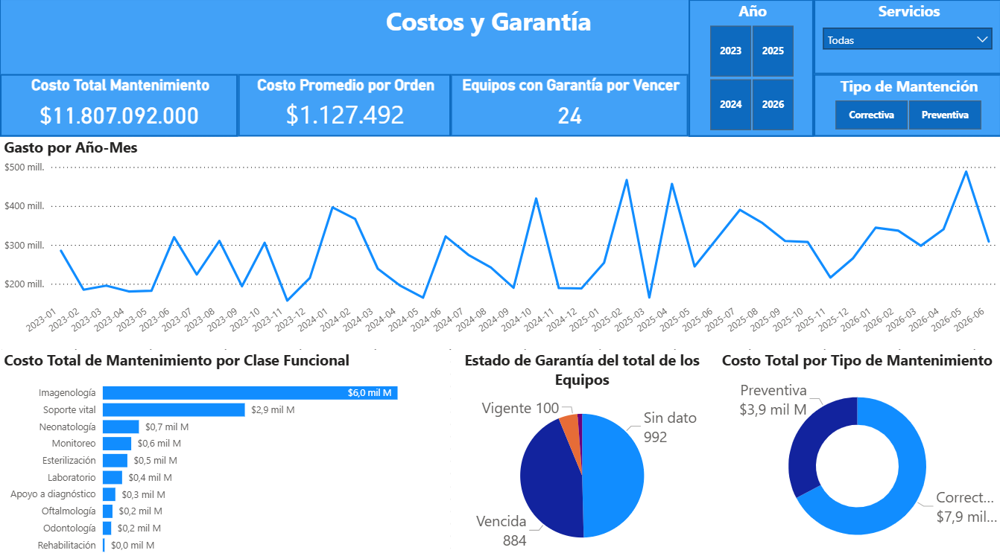
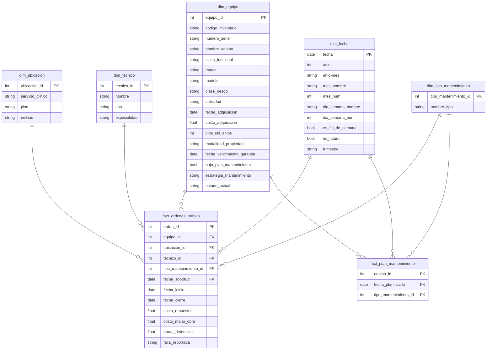

# Dashboard de Gestión de Mantenimiento de Equipos Médicos Hospitalarios

Dashboard simulado para la gestión de mantenimiento con 2000 equipos médicos en un hospital sobre un pipelne de datos reproducible y testeado.

## Escenario
Hospital chieno de complejidad media-alta con 2000 equipos, en una ventana desde el 1 de Enero de 2023 hasta el 30 de Junio de 2026, generandose un corte, por lo que equipos con ordenes después del corte no son evaluables. Conjunto de datos sintéticos y reproducibles con SEED. Los hospitales y clínicas gestionan cientos de equipos médicos, cuya información suele registrarse en varias planillas. Parte de la complejidad de esto es la dificultad de desglosar costos anuales o mensuales, mantenciones o decisiones sobre ciertos equipos, etc.

## El dashboard
### Página 1 — Resumen Ejecutivo

Monitorea el año en curso vs el año anterior, los costos actuales del año.

### Página 2 — Confiabilidad y Mantenimiento

MTBF, MTTR por clase, cumplimiento del plan por año, total de ordenes por servicio y por año-mes.

### Página 3 — Costos y Garantía

Gasto en el tiempo, desglose del gasto en clases y tipo de mantención, estado de garantía.

### Página 4 — Detalle Clase Funcional

Drill-through de clase funcional de visualización MTBF por Clase Funcional; informa costos, órdenes, fallas.

## Arquitectura de datos
[Modelo estrella: 4 dims + 2 facts. Drill-across vía dimensiones conformadas.]

fact_ordenes transaccional, fact_plan factless, dim_fecha en DAX

## Stack
[Python · Power BI · pytest · ruff · GitHub Actions]

