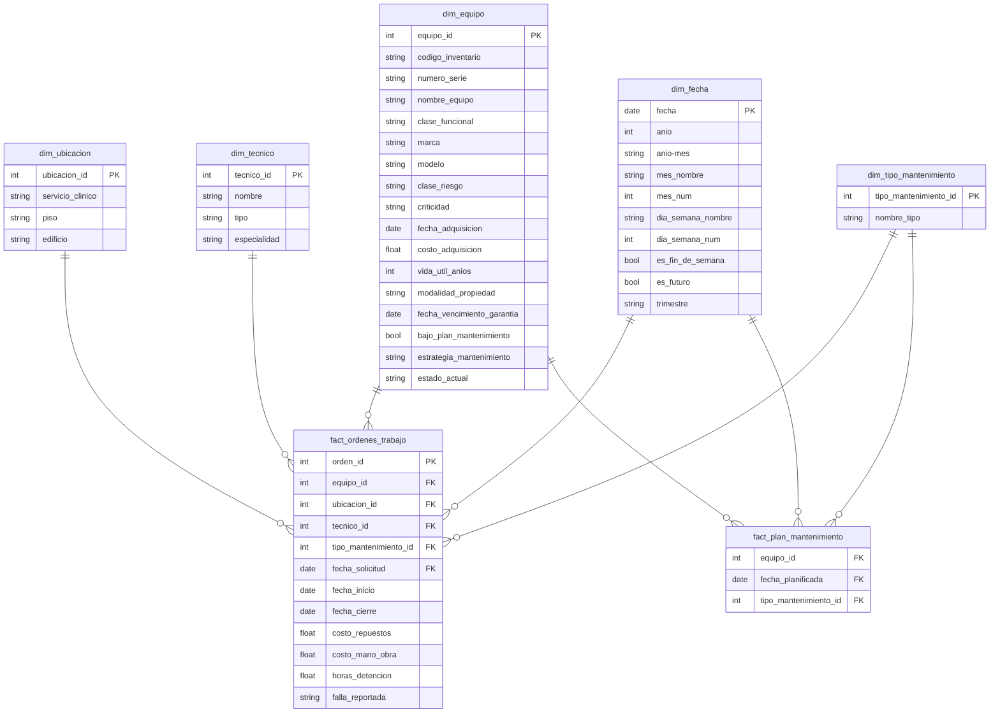

# Modelo de datos

Este diagrama se basa en un escenario simulado de un establaceimiento de salud de mediana-alta complejidad con 4 edificios, 2 edificios de 7 pisos y 2 de 4 pisos. El recinto posee 2000 equipos médicos totales, abarcando distintas clases de riesgo.

En tabla fact_ordenes de trabajo, una fila corresponderá a una orden de trabajo.

En tabla fact_plan_mantenimiento, una fila corresponde un equipo con su mes de mantención planificado.
